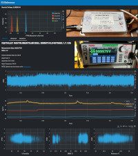
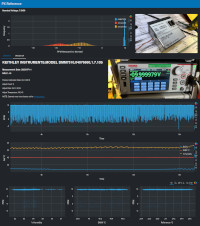
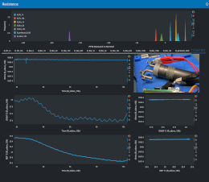

# usa-cal-club-2023

EEVBlog Forums [USA Calibration Club 2023](https://www.eevblog.com/forum/metrology/usa-cal-club-round-3/) Measurements

## Reports

## Navigation

* Notebooks
  * <b>cal_club_2023_jjoonathan_acquisition.ipynb</b>: Grabs data from instruments and writes to CSV
  * <b>cal_club_2023_jjoonathan_analysis.ipynb</b>: Processes CSV and creates HTML reports
* CSV
  * <b>dmm7510_FX_pos.csv</b>: DMM7510 Instrument, FX Reference, Positive polarity
  * <b>dmm7510_PX_pos.csv</b>: DMM7510 Instrument, PX Reference, Positive polarity
  * <b>smu2612a_FX_pos.csv</b>: SMU2612a Instrument, FX Reference, Positive polarity
  * <b>smu2612a_PX_pos.csv</b>: SMU2612a Instrument, PX Reference, Positive polarity
  * <b>smu2651a_FX_pos.csv</b>: SMU2651a Instrument, FX Reference, Positive polarity
* Reports
  * <b>FX.html</b>: FX Reference, all instruments. See: https://jjoonathan.github.io/FX.html
  * <b>PX.html</b>: PX Reference, all instruments. See: https://jjoonathan.github.io/PX.html
  * <b>R.html</b>: Resistance References, DMM7510. See: https://jjoonathan.github.io/R.html
